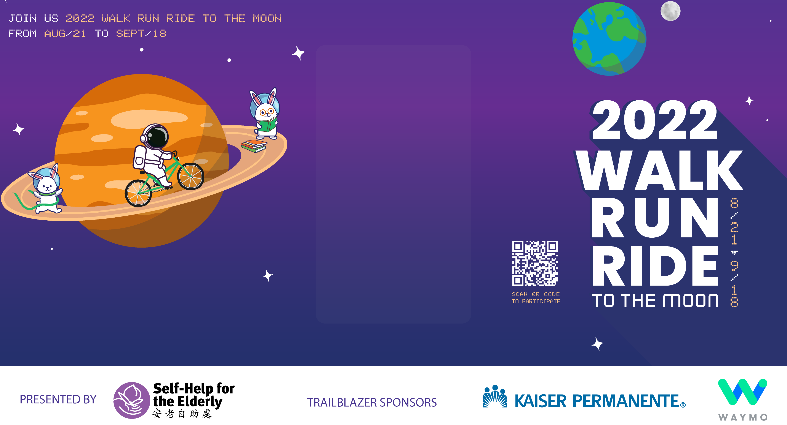

# Online snapshot booth

> URL: https://snapluu.org
A responsive page that brings the photo booth online.
### Preview

### Motivation
I have already utilized HTML and CSS on my previous front-end projects—this time, I want to practice more using JavaScript to program dynamic elements.  In addition, I will develop a web page that can take a selfie and send an email or share it on social media.  It is essential for me because the project is challenging as it contains features that are totally new to me, and completing the project will help improve my full-stack web development skills.

### Why this project
The most critical aspect of front-end development is optimizing user experience.  A great website not only needs to be visually satisfied, but it also needs to have a certain amount of user interactions.  Therefore, I decided to create an online photo booth website to practice developing user-centric applications.  The project helped me get familiar with Back End skills but also helped advertise a non-profit event.

### Description
- Developed a responsive interactive website for users to select frames and take a snapshot
- Added Nodemailer in backend server to allow delivery of instant taken image to a user
- Improved user experience by implementing features for image upload and social media share buttons

### Skills to learn
- JavaScript
- HTML
- CSS
- Node.js
- SMTP
- Express.js
- JSON
- Front-End Development
- Back-End Web Development
- Web Development
- Web Hosting
- Git
